# InnoMightLabs API

A modern, cloud-native API service built with FastAPI, SQLAlchemy, and AWS Lambda, implementing Domain-Driven Design principles for building scalable and maintainable chatbot applications.

## Design Philosophy

InnoMightLabs API follows Domain-Driven Design (DDD) principles with a **chatbot-centric architecture**. The key aspects of our design philosophy include:

### Chatbot-Centric Domain-Driven Design

- **Primary Domain**: `chatbot` is the main domain that orchestrates all interactions
- **Sub-domains**: `conversation` and `messages` are now sub-domains within the chatbot domain
- **Bounded Contexts**: Clear boundaries between chatbot workflows, conversation management, and message handling
- **Entities and Value Objects**: Core domain models are represented as entities with their own identity and lifecycle
- **Repositories**: Data access is abstracted through repository interfaces that handle persistence concerns
- **Services**: Business logic is encapsulated in service classes that operate on domain entities

### Hexagonal Architecture

- **Core Domain Logic**: Isolated from external concerns like databases and APIs
- **Adapters**: Controllers and repositories act as adapters between the core domain and external systems
- **Ports**: Interfaces define how the application interacts with external systems

### Clean Code Principles

- **Single Responsibility**: Each class has a single responsibility and reason to change
- **Dependency Injection**: Dependencies are injected rather than created within components
- **Separation of Concerns**: Clear separation between domain logic, application services, and infrastructure

## New Chatbot-Centric Architecture

```
innomightlabs-api/
├── app/                      # Application source code
│   ├── chatbot/              # 🎯 PRIMARY DOMAIN - Chatbot
│   │   ├── components/       # Chatbot components
│   │   │   ├── conversation_manager.py  # Manages conversation context
│   │   │   ├── mcp_clients/  # MCP client implementations
│   │   │   └── tools/        # Tool implementations
│   │   ├── conversation/     # 📁 SUB-DOMAIN - Conversation management
│   │   │   ├── conversation_entities.py
│   │   │   ├── conversation_models.py
│   │   │   ├── conversation_repositories.py
│   │   │   └── conversation_services.py
│   │   ├── messages/         # 📁 SUB-DOMAIN - Message handling
│   │   │   ├── message_entities.py
│   │   │   ├── message_repositories.py
│   │   │   └── message_services.py
│   │   ├── workflows/        # 🔄 Chatbot workflow implementations
│   │   │   ├── helpers/      # Workflow helper functions
│   │   │   ├── memories/     # Memory management
│   │   │   ├── prompts/      # System prompts
│   │   │   │   └── system/   # System prompt templates
│   │   │   ├── krishna_advance.py  # Advanced workflow
│   │   │   └── krishna_mini.py     # Simple workflow
│   │   ├── chatbot_controller.py   # 🎮 MAIN CONTROLLER
│   │   ├── chatbot_models.py       # 📋 CONSOLIDATED MODELS
│   │   └── chatbot_services.py     # 🔧 Core chatbot services
│   ├── common/               # Shared components and utilities
│   │   ├── config.py         # Application configuration
│   │   ├── controller.py     # Base controller class
│   │   ├── db_connect.py     # Database connection management
│   │   ├── entities.py       # Base entity classes
│   │   └── ...
│   ├── user/                 # User domain
│   └── main.py               # Application entry point
├── infra/                    # Infrastructure as Code (Terraform)
├── migrations/               # Database migration scripts
└── tests/                    # Test suite
```

## Request Flow Architecture

### 🔄 Complete Chatbot Interaction Flow

```mermaid
sequenceDiagram
    participant Client
    participant ChatbotController
    participant ChatbotService
    participant Workflow
    participant ConversationManager
    participant MessageRepository
    participant Database

    Client->>ChatbotController: POST /chatbot/conversations/{id}/messages
    ChatbotController->>ChatbotService: ask_async(AgentRequest)
    ChatbotService->>Workflow: create_workflow(version, state)
    Workflow->>ConversationManager: new(user, conversation_id, repos)
    
    loop Workflow Execution
        Workflow->>Workflow: prompt_builder → thinker → parse_actions → execute_actions
        Workflow-->>Client: StreamingResponse (real-time updates)
    end
    
    Workflow->>ConversationManager: handle_messages(messages)
    ConversationManager->>MessageRepository: fetch_all_messages(conversation_id)
    MessageRepository->>Database: SELECT messages WHERE conversation_id
    Database-->>MessageRepository: Message entities
    MessageRepository-->>ConversationManager: List[Message]
    
    ChatbotController->>MessageRepository: add_messages(user_message, agent_response)
    MessageRepository->>Database: INSERT messages
    ChatbotController-->>Client: Final response with conversation summary
```



## Key Components Explained

### 🎯 ChatbotController (Main Entry Point)
**Location**: `app/chatbot/chatbot_controller.py`

- **Primary endpoint**: `POST /chatbot/conversations/{conversation_id}/messages`
- **Responsibilities**:
  - Receives user messages with `conversation_id` from URL path
  - Creates `AgentRequest` with `conversation_id`, user, message history
  - Streams real-time responses back to client
  - Persists user and agent messages to database via message sub-domain
  - Updates conversation summary via conversation sub-domain

### 🔧 ChatbotService (Core Logic)
**Location**: `app/chatbot/chatbot_services.py`

- **Key method**: `ask_async(request: AgentRequest)`
- **Responsibilities**:
  - Creates `AgentState` with `conversation_id` from request
  - Instantiates appropriate workflow (Krishna Mini/Advance)
  - Manages LLM interactions and embedding generation
  - Handles conversation summarization
  - Coordinates between conversation and message sub-domains

### 🔄 Workflows (AI Processing)
**Location**: `app/chatbot/workflows/`

#### KrishnaAdvanceWorkflow
- **Multi-step reasoning**: prompt_builder → thinker → parse_actions → execute_actions
- **Tool integration**: Can execute Python code, browse web, manage memory
- **Conversation management**: Uses `SlidingWindowConversationManager`
- **MCP integration**: Connects to external tool servers via MCP protocol

#### KrishnaMiniWorkflow  
- **Fast responses**: Direct LLM interaction without complex reasoning
- **Lightweight**: Minimal processing for simple queries

### 🗃️ ConversationManager (Context Management)
**Location**: `app/chatbot/components/conversation_manager.py`

- **Constructor**: `__init__(user, conversation_id, conversation_repo, message_repo)`
- **Key methods**:
  - `get_messages()`: Fetches all messages for the conversation
  - `handle_messages()`: Processes and stores message exchanges
  - `reduce_context()`: Trims conversation history when context limit reached

### 💼 MCP Tools and Clients
**Location**: `app/chatbot/components/tools/mcp_tools.py` and `app/chatbot/components/mcp_clients/`

- **MCP Protocol**: Integration with external tool servers
- **Client Implementation**: Handles connection to MCP servers
- **Tool Registration**: Registers available tools with the workflow

### 📋 Consolidated Models
**Location**: `app/chatbot/chatbot_models.py`

- **ChatbotRequest/Response**: API request/response models (formerly MessageRequest/Response)
- **AgentRequest/State**: Internal workflow models with `conversation_id`
- **PaginatedResult[T]**: Generic pagination for any entity type
- **SingleMessage**: Lightweight message for LLM communication
- **Message**: Full database entity with all fields

## API Endpoints

### Chatbot Interactions
```http
# Send message to chatbot in a conversation
POST /chatbot/conversations/{conversation_id}/messages
Content-Type: application/json
{
  "content": "Hello, how are you?",
  "agent": "krishna-mini",
  "model_id": "gemini-2.0-flash"
}

# Get all messages in a conversation
GET /chatbot/conversations/{conversation_id}/messages

# Get all conversations for user
GET /chatbot/conversations
```

### Conversation Management
```http
# Create new conversation
POST /chatbot/conversations

# Get user's conversations
GET /chatbot/conversations

# Delete conversation
DELETE /chatbot/conversations/{conversation_id}
```

## Data Flow Explanation

### 1. **Request Initiation**
```
Client → ChatbotController
- conversation_id extracted from URL path
- ChatbotRequest contains message content and preferences
```

### 2. **Service Layer Processing**
```
ChatbotController → ChatbotService
- AgentRequest created with conversation_id
- AgentState initialized with conversation context
- ChatbotService accesses conversation and message services as needed
```

### 3. **Workflow Execution**
```
ChatbotService → Workflow (Krishna Mini/Advance)
- ConversationManager instantiated with conversation_id
- Workflow processes user message through multiple steps
- May utilize MCP tools and clients for enhanced capabilities
- Real-time streaming responses sent to client
```

### 4. **Message Persistence**
```
Workflow → ConversationManager → MessageRepository
- Messages stored with conversation_id for proper association
- Conversation summary updated
- Context managed for future interactions
- Messages and conversations now managed within chatbot domain
```

## Getting Started with Local Development

### Prerequisites

- Python 3.13+
- Docker and Docker Compose
- AWS CLI configured with appropriate credentials
- UV package manager (`pip install uv`)

### Step 1: Clone the Repository

```bash
git clone https://github.com/innomightlabs/innomightlabs-api.git
cd innomightlabs-api
```

### Step 2: Set Up Environment Variables

Create a `.envrc` file in the project root with the following variables:

```bash
export POSTGRES_USER=postgres
export POSTGRES_PASSWORD=your_password
export POSTGRES_DB=innomightlabs
export STAGE=local
export AWS_PROFILE=your_aws_profile  # Only needed for local development
```

If you're using direnv, run:

```bash
direnv allow
```

Otherwise, source the file:

```bash
source .envrc
```

### Step 3: Start the Database

```bash
docker-compose up -d db
```

### Step 4: Install Dependencies

```bash
uv pip install --system .
```

### Step 5: Run Database Migrations

```bash
alembic upgrade head
```

### Step 6: Start the API Server

```bash
uvicorn app.main:app --reload
```

The API will be available at http://localhost:8000. You can access the Swagger UI documentation at http://localhost:8000/docs.

## CI/CD Pipeline

The project uses GitHub Actions for continuous integration and deployment. The workflow is defined in `.github/workflows/ci.yml` and includes the following stages:

### Build Stage

- Checks out the code
- Sets up Python 3.13
- Installs dependencies using UV
- Runs linting with Ruff

### Test Stage

- Sets up a PostgreSQL database using Docker Compose
- Runs database migrations
- Starts the FastAPI application
- Performs health checks

### Deploy Stage (only on main branch)

- Builds and pushes a Docker image to Amazon ECR
- Deploys infrastructure using Terraform
- Runs database migrations in the deployed environment
- Outputs the API Gateway URL

## Contributing

### Prerequisites

- Python 3.13+
- UV package manager
- Docker and Docker Compose

### Setup Development Environment

1. Fork the repository
2. Clone your fork:
   ```bash
   git clone https://github.com/your-username/innomightlabs-api.git
   ```
3. Set up environment variables as described in the "Getting Started" section
4. Install dependencies:
   ```bash
   uv pip install --system .
   ```
5. Install development dependencies:
   ```bash
   uv pip install --system .[dev]
   ```

### Development Workflow

1. Create a new branch for your feature:
   ```bash
   git checkout -b feature/your-feature-name
   ```
2. Make your changes
3. Run linting:
   ```bash
   ruff check .
   ```
4. Run tests:
   ```bash
   pytest
   ```
5. Commit your changes:
   ```bash
   git commit -m "Add your feature description"
   ```
6. Push to your fork:
   ```bash
   git push origin feature/your-feature-name
   ```
7. Create a pull request to the `dev` branch of the main repository

### Code Style Guidelines

- Follow PEP 8 guidelines
- Use type hints for all function parameters and return values
- Write docstrings for all public functions and classes
- Keep functions small and focused on a single responsibility
- Use meaningful variable and function names